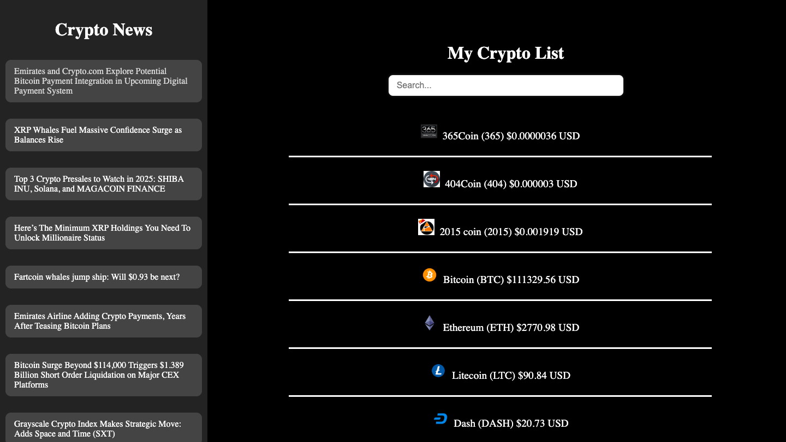

# Web Development Lab 5 - *Crypto Hustle Lite*

Submitted by: **Kelly Chan**

This web app: **displays information about cryptocurrencies, such as their value, market cap, and percent change in value, which I accessed using API calls. I also implemented a search bar that allows users to search for a specific currency.**

Time spent: **1** hours spent in total

## Required Features

The following **required** functionality is completed:

- [X] User can view a list of at least 30 cryptocurrencies, including the image, name, and price of the coin in US dollars
- [X] User can search for a specific coin in the list of cryptocurrencies by symbol

The following **optional** features are implemented:

- [X] User can view a list of cryptocurrency news on a separate pane in the page

## Image

Here's a image of implemented features:

## License

    Copyright 2025 Kelly Chan

    Licensed under the Apache License, Version 2.0 (the "License");
    you may not use this file except in compliance with the License.
    You may obtain a copy of the License at

        http://www.apache.org/licenses/LICENSE-2.0

    Unless required by applicable law or agreed to in writing, software
    distributed under the License is distributed on an "AS IS" BASIS,
    WITHOUT WARRANTIES OR CONDITIONS OF ANY KIND, either express or implied.
    See the License for the specific language governing permissions and
    limitations under the License.
